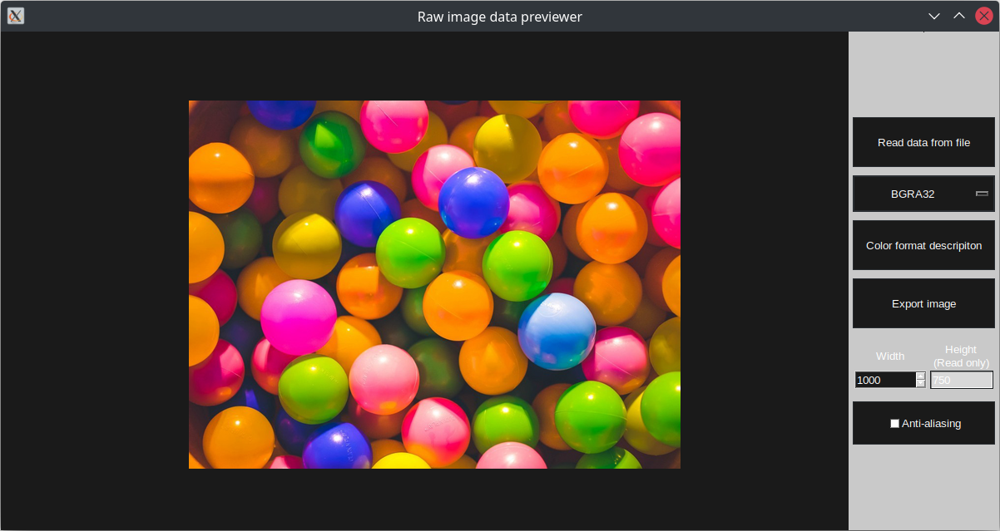

# Raw image data previewer

Raw image data previewer is an open-source utility dedicated to parsing and displaying binary data acquired straight from camera.



This simple utility provides options like:
* previewing most used raw color formats
    * RGB-like formats
    * YUVs (packed, semiplanar, planar)
    * Grayscales
    * Bayer RGBs
* exporting raw image data to more complex formats (ie. PNG, JPG)

# Installation

## Requirements

* Python >=v3.9
* numpy
* opencv
* PIL

## Installation

### Manjaro Linux

```bash
sudo pacman -Sy python-pip git
git clone https://github.com/antmicro-labs/raw-image-data-previewer.git
cd raw-image-data-previewer
pip install -r requirements.txt
```

### Ubuntu 20.04

```bash
sudo apt-get install python3-pip git
git clone https://github.com/antmicro-labs/raw-image-data-previewer.git
cd raw-image-data-previewer
python3 -m pip install -r requirements.txt
```

# Usage

To start empty GUI (without loaded data) use:
```bash
cd raw-image-data-previewer
python3 -m app
```

You can also start GUI with already loaded data and parameters (like width and color format). More informations about available arguments can be found in command-line help:
```bash
cd raw-image-data-previewer
python3 -m app --help
```

## Exporting images
Utility also provides a way to convert binary files containing image data to more complex formats (ie. PNG, JPG) without starting grahpical interface.
To use ths option simply add argument `--export` with destination file and its extension.


## Supported formats informations

Currently supported color formats and planned ones can be found [here](docs/SUPPORTED_FORMATS.md).

# Extending supported color formats

## Adding new color formats

Currently there are two classes that can describe color formats: `ColorFormat` and `SubsampledColorFormat` (found in `app/image/color_format.py`).
To create new color format, simply:
1. Under `AVAILABLE_FORMATS` list in `color_format.py` add new instance of one of the color format classes with proper fields filled.
2. Provide parsing and displaying function by extending `AbstractParser` found in `common.py` or by using existing one.
    * If you choose to implement new one remember, that `parse()` should return one dimensional `ndarray` with values read from the binary file. `display()` on the other hand should return RGB-formatted 3-dimensional `ndarray` consisting of original color format values converted to RGB24.
3. Utility provides proper parser by checking color format parameteres (mainly `PixelFormat`), so make sure, that your new color format has a valid translation of parameteres to one of the parsers (this functionality can be found in `app/parser/factory.py`).

## Contributors

* Błażej Ułanowicz ([blazejulanowicz](https://github.com/blazejulanowicz))
* Dawid Dopart ([DopartDawid](https://github.com/DopartDawid))
* Maciej Tylak ([Ty7ak](https://github.com/Ty7ak))
* Maciej Franikowski ([MaciejFranikowski](https://github.com/MaciejFranikowski))

# License

Utility is licensed under Apache-2 license. More on that [here](LICENSE).